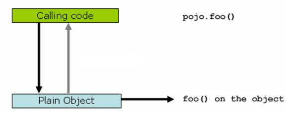
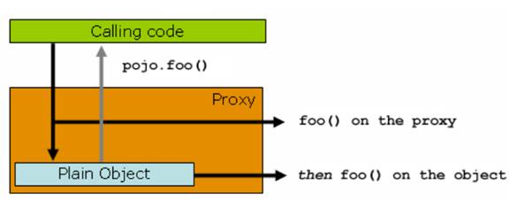

[【我只想看用法】](#使用easycache简化缓存管理)
[【版本更新列表】](#版本更新列表)

# 为什么要使用缓存
缓存主要有两个用途：**高性能**和**高并发**。

- 高性能

  无状态的组件一般来说扩展性会好一点，但它们也会更加倾向于一遍遍地问相同的问题，因为它们是无状态的，所以一旦当前的任务完成，就会丢弃掉已经获取的所有解答，下一次需要相同的答案时，它们就不得不再问一遍这个问题。

  如果问题的答案变更不是那么频繁（或者根本不会发生变化），那么按照相同的方式再去获取一遍就是一种浪费了。除此之外，这样做还可能会对应用的性能产生负面影响。一遍又一遍地问相同的问题，而每次得到的答案都是一样的，与其这样，我们还不如只问一遍并将答案记住，以便稍后再次需要时使用。

  缓存可以存储经常会用到的信息，这样每次需要的时候，这些信息都是立即可用的。

- 高并发

  MySQL对高并发的支持并不好，单机支撑到2000QPS就可能会报警了。

  所以要是你有个系统，高峰期一秒钟过来的请求有1万，那一个 MySQL 单机绝对会死掉。你这个时候就只能上缓存，把很多数据放缓存。缓存功能简单，说白了就是 key-value 式操作，单机支撑的并发量轻松一秒几万十几万。单机承载并发量是 MySQL 单机的几十倍。

# EasyCache的特点
- 通过少量的注解即可使得既有代码支持缓存
- 支持开箱即用
- 支持 Spring Express Language，能使用对象的任何属性或者方法来定义缓存的 key 和 condition
- 支持自定义 key 和自定义缓存管理器，具有相当的灵活性和扩展性

# EasyCache与Spring Cache的比较
- EasyCache的键支持模糊查询
- EasyCache的键支持过期时间

# 如果不采用基于注解的缓存模式会怎样？
这里先展示一个完全自定义的缓存实现，即不用任何第三方的组件来实现某种对象的内存缓存。

场景是：对一个账号查询方法做缓存，以账号名称为 key，账号对象为 value，当以相同的账号名称查询账号的时候，直接从缓存中返回结果，否则更新缓存。账号查询服务还支持 reload 缓存（即清空缓存）。

首先定义一个账号类，具备基本的 id 和 name 属性，且具备 getter 和 setter 方法
```java
package cacheOfAnno; 
 
public class Account { 
  private int id; 
  private String name; 
  
  public Account(String name) { 
    this.name = name; 
  } 
  public int getId() { 
    return id; 
  } 
  public void setId(int id) { 
    this.id = id; 
  } 
  public String getName() { 
    return name; 
  } 
  public void setName(String name) { 
    this.name = name; 
  } 
}
```
然后定义一个缓存管理器，这个管理器负责实现缓存逻辑，支持对象的增加、修改和删除，支持值对象的泛型。如下：
```java
package oldcache; 
 
import java.util.Map; 
import java.util.concurrent.ConcurrentHashMap; 
 
public class MyCacheManager<T> { 
  private Map<String,T> cache = 
      new ConcurrentHashMap<String,T>(); 
  
  public T getValue(Object key) { 
    return cache.get(key); 
  } 
  
  public void addOrUpdateCache(String key,T value) { 
    cache.put(key, value); 
  } 
  
  public void evictCache(String key) {// 根据 key 来删除缓存中的一条记录
    if(cache.containsKey(key)) { 
      cache.remove(key); 
    } 
  } 
  
  public void evictCache() {// 清空缓存中的所有记录
    cache.clear(); 
  } 
}
```
好，现在我们有了实体类和一个缓存管理器，还需要一个提供账号查询的服务类，此服务类使用缓存管理器来支持账号查询缓存，如下：
```java
package oldcache; 
 
import cacheOfAnno.Account; 
 
public class MyAccountService { 
  private MyCacheManager<Account> cacheManager; 
  
  public MyAccountService() { 
    cacheManager = new MyCacheManager<Account>();// 构造一个缓存管理器
  } 
  
  public Account getAccountByName(String acctName) { 
    Account result = cacheManager.getValue(acctName);// 首先查询缓存
    if(result!=null) { 
      System.out.println("get from cache..."+acctName); 
      return result;// 如果在缓存中，则直接返回缓存的结果
    } 
    result = getFromDB(acctName);// 否则到数据库中查询
    if(result!=null) {// 将数据库查询的结果更新到缓存中
      cacheManager.addOrUpdateCache(acctName, result); 
    } 
    return result; 
  } 
  
  public void reload() { 
    cacheManager.evictCache(); 
  } 
  
  private Account getFromDB(String acctName) { 
    System.out.println("real querying db..."+acctName); 
    return new Account(acctName); 
  } 
}
```
现在我们开始写一个测试类，用于测试刚才的缓存是否有效
```java
package oldcache; 
 
public class Main { 
 
  public static void main(String[] args) { 
    MyAccountService s = new MyAccountService(); 
    // 开始查询账号
    s.getAccountByName("somebody");// 第一次查询，应该是数据库查询
    s.getAccountByName("somebody");// 第二次查询，应该直接从缓存返回
    
    s.reload();// 重置缓存
    System.out.println("after reload..."); 
    
    s.getAccountByName("somebody");// 应该是数据库查询
    s.getAccountByName("somebody");// 第二次查询，应该直接从缓存返回
    
  } 
 
}
```
按照分析，执行结果应该是：首先从数据库查询，然后直接返回缓存中的结果，重置缓存后，应该先从数据库查询，然后返回缓存中的结果，实际的执行结果如下：
```
real querying db...somebody// 第一次从数据库加载
get from cache...somebody// 第二次从缓存加载
after reload...// 清空缓存
real querying db...somebody// 又从数据库加载
get from cache...somebody// 从缓存加载
```
可以看出我们的缓存起效了，但是这种自定义的缓存方案有如下劣势：
- 缓存代码和业务代码耦合度太高，如上面的例子，AccountService 中的 getAccountByName()方法中有了太多缓存的逻辑，不便于维护和变更
- 不灵活，这种缓存方案不支持按照某种条件的缓存，比如只有某种类型的账号才需要缓存，这种需求会导致代码的变更
- 缓存的存储这块写的比较死，不能灵活的切换为使用第三方的缓存模块

如果你的代码中有上述代码的影子，那么你可以考虑按照下面的介绍来优化一下你的代码结构了，也可以说是简化，你会发现，你的代码会变得优雅的多！

# 使用EasyCache简化缓存管理

## 引入依赖
```xml
<dependency>
    <groupId>net.gvsun.utils</groupId>
    <artifactId>EasyCache</artifactId>
    <version>1.1.1-SNAPSHOT</version>
</dependency>
```

## 启动EasyCache
```java
@SpringBootApplication
@EnableEasyCache //启动EasyCache
public class MyApplication {
    public static void main(String[] args) {
        SpringApplication.run(Oauth2Application.class, args);
    }
}
```
下面的配置是可选的，给你自己的项目添加一个命名空间，这样可以防止你定义的键和其他项目的键发生冲突：
```java
@Configuration
public class CachingConfig {
    @Bean
    @Primary
    public EasyCacheConfig easyCacheConfig() {//EasyCache的全局配置
        EasyCacheConfig easyCacheConfig = new EasyCacheConfig();
        easyCacheConfig.setNamespace("OAuth2");
        return easyCacheConfig;
    }
}
```

## 在需要缓存的方法上添加注解
假设我们有一个方法getUserByUsername()，这是一个非常耗时的操作，现在我们把它的结果进行缓存：
```java
@Service
public class TestService {
    @Cache(key = "'user-' + #args[0]")
    public User getUserByUsername(String username) {
        //从数据库里查询出用户数据
        return user;
    }
}
```
当系统首次调用这个方法时，由于在缓存中找不到数据，就会执行该方法，然后把得到的数据放入缓存，当下一次再相同的参数调用这个方法时，就会从缓存中获取数据，而不是再次执行这个方法。

像上面那样设置缓存的键是可以的，但是如果我们有很多username，将会导致redis里有很多的key；更推荐的一种做法是把方法名作为key，把参数作为hkey：
```java
@Service
public class TestService {
    @Cache(key = "'getUserByUsername'", hkey = "#args[0]")
    public User getUserByUsername(String username) {
        //从数据库里查询出用户数据
        return user;
    }
}
```
`@Cache`还支持过期时间，和按条件进行缓存。[【点击查看详情】](#@Cache、@CacheDelete注释介绍)

`key`和`hkey`是支持SpringEl表达式，例如：`#args[0]`表示调用方法时传入的第一个参数；`retVal`表示方法的返回值；

## 如何清空缓存？
当我们更新用户的数据时，需要清除旧的缓存：
```java
@Service
public class TestService {
    ....

    @CacheDelete(keys = "'user-' + #args[0]")
    public void updateUser(String username) {
        //更新数据库
    }
}
```

## 如何按照条件操作缓存？
有时候我们需要根据一定的条件来决定是否需要清除缓存，下面是一个例子，如果username是以2开头的则清除缓存：
```java
@CacheDelete(keys = "'user-' + #args[0]", condition = "#args[0].startsWith('2')")
public void updateUser(String username) {
    //更新数据库
}
```

# @Cache、@CacheDelete注释介绍
|@Cache包含的属性|描述|
|-|-|
|expire|缓存的过期时间，默认永不过期|
|key|自定义的缓存key，支持SpringEL表达式|
|hkey|设置哈希表中的字段，如果设置此项，则用哈希表进行存储，支持SpringEL表达式|
|condition|缓存的条件表达式，如果得到的值是 false 的话，不会将缓存应用到方法调用上。默认为true|
|cacheOperateType|缓存的操作类型默认是READ_WRITE|

|@CacheDelete包含的属性|描述|
|-|-|
|condition|缓存的条件表达式，如果得到的值是 false 的话，不会将缓存应用到方法调用上|
|keys|要删除的缓存的键的数组（键支持通配符：* ? []）|
|hkeys|设置哈希表中的字段，如果设置此项，则删除哈希表中指定的项，支持SpringEL表达式|
|beforeInvocation|是否在方法执行前就清空，缺省为 false，如果指定为 true，则在方法还没有执行的时候就清空缓存，缺省情况下，如果方法执行抛出异常，则不会清空缓存|

# EasyCache的设计思想

## 代理
EasyCache的关键原理就是spring AOP，通过 spring AOP，其实现了在方法调用前、调用后获取方法的入参和返回值，进而实现了缓存的逻辑。我们来看一下下面这个图：



上图显示，当客户端“Calling code”调用一个普通类 Plain Object 的 foo() 方法的时候，是直接作用在 pojo 类自身对象上的，客户端拥有的是被调用者的直接的引用。

而 EasyCache 利用了 Spring AOP 的动态代理技术，即当客户端尝试调用 pojo 的 foo（）方法的时候，给他的不是 pojo 自身的引用，而是一个动态生成的代理类：



如上图所示，这个时候，实际客户端拥有的是一个代理的引用，那么在调用 foo() 方法的时候，会首先调用 proxy 的 foo() 方法，这个时候 proxy 可以整体控制实际的 pojo.foo() 方法的入参和返回值，比如缓存结果，比如直接略过执行实际的 foo() 方法等，都是可以轻松做到的。

## 委托

由于锁的排他性，如果短时间内有大量线程访问同一个键，后续线程的访问操作将
被委托给第一个发起访问的线程来完成。（这里的“短时间内”代表的是在第一个线程还未完成访问操作时，又有新的线程试图访问同一个键）。这可以有效的预防缓存击穿问题。

在讨论委托的实现之前，我们先来了解什么是缓存击穿。缓存击穿，就是说某个 key 非常热点，访问非常频繁，处于集中式高并发访问的情况，当这个 key 在失效的瞬间，大量的请求就击穿了缓存，直接请求数据库，就像是在一道屏障上凿开了一个洞。例如，下面的程序在短时间内发起大量请求：
```java
for (int i = 0; i < 200; i++) {
    new Thread(new Runnable() {
        @Override
        public void run() {
            try {
                User user = testService.getUserByUsername(username);
            } catch (InterruptedException e) {
                e.printStackTrace();
            }
        }
    }).start();
}
```
```java
@Cache(key = "'getUserByUsername(username=' + #args[0] + ')'")
public User getUserByUsername(String username) throws InterruptedException {
    Thread.sleep(3000);
    System.out.println("缓存被击穿");
    return new User("zhangsan", "1234");
}
```
我们对`testService.getUserByUsername()`做了缓存处理，在没有命中缓存的情况下， 假设`testService.getUserByUsername()`方法访问数据库所消耗的时间为3s，当首次运行上面的代码时，第一个请求的线程：查看缓存中是否有数据并且没有过期 -> 没有发现缓存，调用被缓存注解的方法去数据源中获取结果数据 -> 将获取到的数据写入缓存。这一系列过程将在超过3s的时间内被完成。而同时，在第一个线程运行期间，后续的199个线程也会对同一个键进行操作，如果后续的线程没有把工作委托给第一个线程，那么后续的199个线程将也会从数据源中获取数据（假设这199个线程在3s只能即可全部运行起来），但这是没有必要的开销。

## 缓存的自动刷新


# 版本更新列表
## 1.0.1-SNAPSHOT
去除日志框架

## 1.1.0-SNAPSHOT
1. 修复bug，为注解添加新属性：

|@Cache包含的属性|描述|
|-|-|
|expire|缓存的过期时间，默认永不过期|
|key|自定义的缓存key，支持SpringEL表达式|
|hkey|设置哈希表中的字段，如果设置此项，则用哈希表进行存储，支持SpringEL表达式|
|condition|缓存的条件表达式，如果得到的值是 false 的话，不会将缓存应用到方法调用上。默认为true|
|cacheOperateType|缓存的操作类型默认是READ_WRITE|
|*namespace*|该键所属的命名空间，如果设置，则EasyCacheConfig中配置的命名空间失效|

|@CacheDelete包含的属性|描述|
|-|-|
|condition|缓存的条件表达式，如果得到的值是 false 的话，不会将缓存应用到方法调用上|
|keys|要删除的缓存的键的数组（键支持通配符：* ? []）|
|hkeys|设置哈希表中的字段，如果设置此项，则删除哈希表中指定的项，支持SpringEL表达式|
|beforeInvocation|是否在方法执行前就清空，缺省为 false，如果指定为 true，则在方法还没有执行的时候就清空缓存，缺省情况下，如果方法执行抛出异常，则不会清空缓存|
|*namespace*|该键所属的命名空间，如果设置，则EasyCacheConfig中配置的命名空间失效|

2. 把数据缓存到Redis时支持配置压缩阈值（默认为1024字节，超过则压缩，否则不压缩）

## 1.1.1-SNAPSHOT
1. 修复@CacheDelete批量删除bug

## 1.1.2-SNAPSHOT
1. 优化

## [1.2.0-SNAPSHOT, 1.2.2-SNAPSHOT]
1. 修改EasyCache配置，不复用spring redis配置，需要单独指定配置。